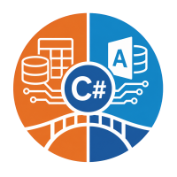

# UCanAccess-csharp

A pure .NET ADO.NET provider and file-format implementation for Microsoft Access
`.mdb` and `.accdb` databases.

No Microsoft Access. No ODBC. No ACE driver.

[](https://dotnet.microsoft.com/)
[](https://www.apache.org/licenses/LICENSE-2.0)
[](https://github.com/justybase/JustyBase.UCanAccessCs)

---

## What is it?

UCanAccess-csharp is a C# port of the Java
[Jackcess](https://sourceforge.net/projects/jackcess/) file-format library and
[UCanAccess](https://ucanaccess.sourceforge.net/) JDBC driver. It lets .NET
applications open, query, and modify Microsoft Access databases without any
Microsoft software installed:

- **File layer** — reads Jet 3/4 (`.mdb`) and Access 2007/2010/2016 (`.accdb`)
  files; writes rows, long values, indexes, and table DDL with
  Jackcess-compatible output.
- **SQL provider** — an in-memory SQLite mirror with an Access-to-SQLite
  translator exposes the Access SQL dialect through the standard ADO.NET
  abstractions (`DbConnection`, `DbCommand`, `DbTransaction`, `DbDataReader`).
- **Safe write path** — autocommit DML is prepared on a private staging copy,
  installed atomically, and refreshes only affected mirror tables; file-backed
  SQLite mirrors are available for large databases.
- **Access semantics** — `TRANSFORM/PIVOT` crosstabs, `TOP`, `DISTINCTROW`,
  `LIKE`, date literals, ~80 VBA functions, exact `MONEY`/`NUMERIC` arithmetic,
  and behavior verified against the original Java implementation.

## Quick start

```csharp
using UCanAccess;

using var connection = UCanAccessFactory.Instance.CreateConnection()!;
connection.ConnectionString =
    "Data Source=C:\\data\\Northwind.mdb;Read Only=false";
connection.Open();

using var command = connection.CreateCommand();
command.CommandText = "SELECT * FROM [Order Details] WHERE Quantity > ?";
var parameter = command.CreateParameter();
parameter.Value = 1;
command.Parameters.Add(parameter);

using var reader = command.ExecuteReader();
while (reader.Read())
{
    Console.WriteLine(reader.GetValue(0));
}
```

The low-level file API is available as well:

```csharp
using UCanAccess.File;

using var database = Database.Open("C:\\data\\Northwind.mdb");
foreach (string name in database.GetTableNames())
{
    Console.WriteLine($"{name}: {database.GetTable(name)!.RowCount} rows");
}
```

## Connection-string options

| Option | Values | Notes |
|---|---|---|
| `Data Source` | path | Required. |
| `Read Only` | `true` (default) / `false` | |
| `Encoding` / `Code Page` | | Text decoding. |
| `Show Schema` | | Schema visibility. |
| `Column Order` | `natural` / `display` | |
| `Lazy Load` | | |
| `Keep Mirror` | | Mirror lifetime. |
| `Mirror Mode` | `memory` / `file` | SQLite storage mode; memory is the default. |
| `Mirror Path` | path | Explicit SQLite path for `Mirror Mode=file`. |
| `Mirror Folder` | path | Folder for an automatically named file mirror. |
| `Allow External Links` | | Required to open external link targets. |
| `New Database Version` | `2000` / `2002` / `2003` / `2007` / `2010` / `2016` | For `Database.Create`. |
| `Time Zone`, `Prefer Date Timestamp` | | Accepted for compatibility; Access stores dates without timezone metadata and the provider exposes them as `DateTime`. |
| `Password` / `PWD` | | Passed to an application-supplied `IAccessDatabaseOpener`; masked when the connection string is displayed. |

- `UCanAccessConnection.RegisterFunction` adds a connection-local scalar
  function; register it before `Open()`.
- Transactions support `DbTransaction.Save` and rollback-to-savepoint through
  private staging snapshots.
- `UCanAccessConnection.LastInsertedId` exposes the numeric Access AutoNumber
  generated by the most recent successful INSERT.
- Native linked databases are resolved relative to the main database directory.
- Access financial functions (`PMT`, `PV`, `RATE`, ...) take a periodic rate as
  a fraction (`0.10` means 10%), matching Access and UCanAccess.

## Current limitations

The implementation intentionally reports unsupported operations instead of
silently changing the file. Known gaps include:

- password-encrypted databases require an application-supplied
  `IAccessDatabaseOpener` — the core package does not bundle an Access
  encryption codec;
- existing complex fields (multi-value, attachments) are exposed as typed
  arrays and their flat child rows can be written, but creating a new complex
  field through DDL is unsupported;
- calculated-column and relationship-bearing table recreation, `CREATE/DROP
  VIEW`, and `TOP ... PERCENT` remain limited;
- explicit and inline dynamic crosstab queries are supported; parameterized
  saved dynamic crosstabs remain limited;
- recognized `MONEY`/`NUMERIC` expressions use the exact-decimal mirror path,
  while arbitrary expressions may retain SQLite's normal affinity;
- DML uses SQLite's translated expression engine for correlated subqueries,
  `UPDATE ... JOIN`, `DELETE ... JOIN`, and Access function expressions. A JOIN
  that produces different values for the same target row is rejected rather
  than applied nondeterministically;
- `Mirror Mode=file` stores the query mirror on disk, but the file is still a
  provider-owned cache and is rebuilt when the connection opens;
- column-level `NOT NULL` is supported, but adding it to a non-empty table
  requires a default and is otherwise rejected;
- atomic transactions reject databases containing native linked tables.

Atomic commit and index DDL replace the open database file — low-level objects
obtained from a previous database instance must not be used after that
operation.

## Documentation

| Document | What it covers |
|---|---|
| [Getting started](docs/GETTING_STARTED.md) | Writes, transactions, savepoints, user-defined functions, low-level API. |
| [Compatibility matrix](docs/COMPATIBILITY_MATRIX.md) | The ADO.NET behavior contract, feature by feature. |
| [SQL compatibility](docs/SQL_COMPATIBILITY.md) | Supported Access SQL syntax and translation. |
| [Coverage](docs/COVERAGE.md) | Test coverage baselines and CI collection contract. |
| [Security policy](SECURITY.md) | Supported versions and private vulnerability reporting. |

The sample databases in `samples/` are real Access files, so every example can
be verified without Microsoft Access or ACE.

## Repository layout

```text
src/UCanAccess.File/   Access file-format reader/writer
src/UCanAccess/        ADO.NET provider, mirror, SQL translator, functions
src/UCanAccess.Console CLI dump/create utility
tests/                 xUnit and Java-oracle parity tests
tools/JavaOracle/      Java Jackcess/UCanAccess oracle harness
tools/GeneratePolishSample/  regenerates samples/sample_polish.accdb
tools/GenerateLinkedSamples/ regenerates samples/linked/{A,B}.mdb
```

The SQL lexer infrastructure comes from the
[`JustyBase.NetezzaSqlParser`](https://www.nuget.org/packages/JustyBase.NetezzaSqlParser)
NuGet package (version set once in `Directory.Build.props` as
`JustyBaseParserVersion`).

## Tests

```text
dotnet build UCanAccess.slnx
dotnet test UCanAccess.slnx
```

The suite contains file-layer differential tests, SQL parity tests against
UCanAccess 5.1.6, window-function tests executed by the SQLite mirror, DDL
checks, write-path tests, and ADO.NET tests. Java-backed tests are skipped
explicitly when a compatible Java runtime or the downloaded oracle jars are not
available. Any JDK distribution version 11 or newer is supported; the oracle
script also honors `UCANACCESS_JAVA`, `UCANACCESS_JAVAC` and `JAVA_HOME`.
Regenerate the oracle artifacts with:

```text
pwsh tools/JavaOracle/run.ps1
```

Opt-in 100,000-row performance comparison against the original Jackcess
implementation (insert and read):

```powershell
$env:UCANACCESS_PERF = "1"
dotnet test tests/UCanAccess.Tests/UCanAccess.Tests.csproj --filter FullyQualifiedName~InsertBenchmarkTests
```

Use `UCANACCESS_PERF_ROWS` to override the row count. The Java benchmark
requires a compatible Java runtime, the oracle classes and
`jackcess-5.1.5.jar` prepared by `tools/JavaOracle/run.ps1`.

Coverage is available through the standard collector:

```powershell
dotnet test UCanAccess.slnx --collect:"XPlat Code Coverage" --results-directory TestResults
```

For bulk low-level writes, use the non-atomic batch API to keep modified pages
in memory and flush them once:

```csharp
using var batch = database.BeginWriteBatch();
for (int i = 0; i < 100_000; i++)
{
    table.AddRow(values);
}
batch.Commit();
```

`WriteBatch` does not provide rollback; an interrupted process can leave a
partially written database.

## License

Apache License 2.0. This project is a translation/port of Jackcess and
UCanAccess; original copyrights remain with their authors. See
[`NOTICE`](NOTICE).
